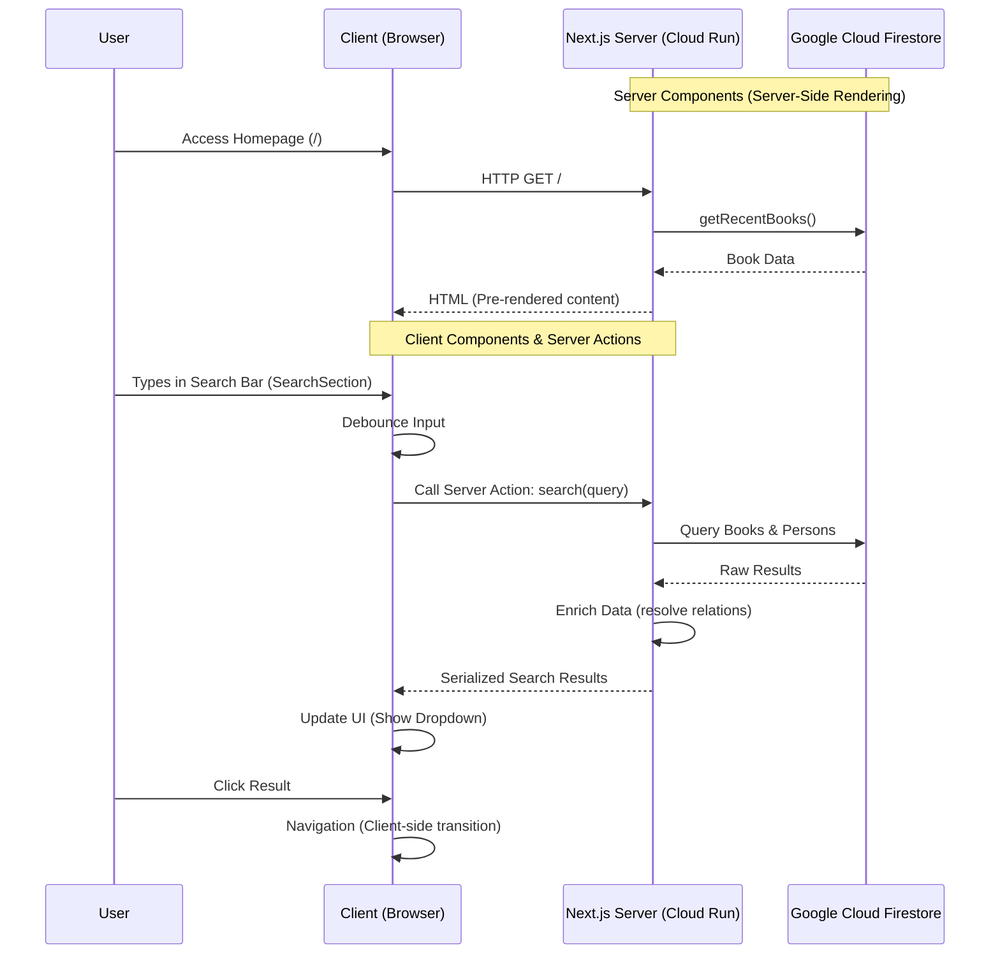

# Aozora Pages Architecture

This document outlines the architecture of the Aozora Pages application, built with Next.js App Router and hosted on Google Cloud Run.

## Overview

The application utilizes a hybrid rendering approach leveraging Next.js App Router's Server Components and Client Components, interacting with Google Cloud Firestore for data persistence.

### Core Technologies
- **Framework**: Next.js (App Router)
- **Deployment**: Google Cloud Run (Containerized)
- **Database**: Google Cloud Firestore
- **Styling**: CSS Modules / Tailwind CSS

## Component Architecture

The application rigorously separates concerns between server and client to optimize performance and SEO.

### Server Components (`.tsx`)
By default, components in `app/` are Server Components. They render on the server, fetching data directly from Firestore before sending HTML to the client. This reduces client-side JavaScript bundle size.

**Key Server Components:**
- **`app/page.tsx`**: The main entry point. Fetches `recentBooks` directly from Firestore serverside and renders the initial list.
- **`components/BookCard.tsx`**: Purely presentational component that renders book details. Since it requires no interactivity, it remains a server component.
- **`app/layout.tsx`**: Defines the global application shell.

### Client Components (`'use client'`)
Client Components are opted-in via the `'use client'` directive. These handle user interactivity and browser APIs.

**Key Client Components:**
- **`components/SearchSection.tsx`**: Handles the recursive search UI.
  - Manages input state (`useState`).
  - Debounces user input.
  - Invokes Server Actions to fetch search results.
  - Renders interactive search results dropdown.
- **`components/SearchInput.tsx`**: A reusable input component for handling navigation-based search queries.

### Server Actions (`actions.ts`)
Server Actions provide a secure way to execute server-side logic from Client Components without creating a separate API route.

- **`search(query)`**:
  - Located in `app/actions.ts`.
  - Called directly by `SearchSection.tsx`.
  - Queries Firestore for Books and Persons matching the query.
  - Returns enriched data (e.g., resolving Author names) to the client.

## Data Flow & Interaction Diagram

The following diagram illustrates the separation of concerns and data flow between the Client, Server, and Database.



## Directory Structure Map

```
web/src/
├── app/
│   ├── page.tsx          # [Server] Main landing page, fetches data
│   ├── layout.tsx        # [Server] Root layout
│   └── actions.ts        # [Server Action] Search logic
├── components/
│   ├── BookCard.tsx      # [Server] Stateless UI for book display
│   ├── SearchSection.tsx # [Client] Stateful search with dropdown
│   └── SearchInput.tsx   # [Client] Input managing URL params
└── lib/
    └── firestore/        # [Server] Data access layer (Firestore SDK)
```
