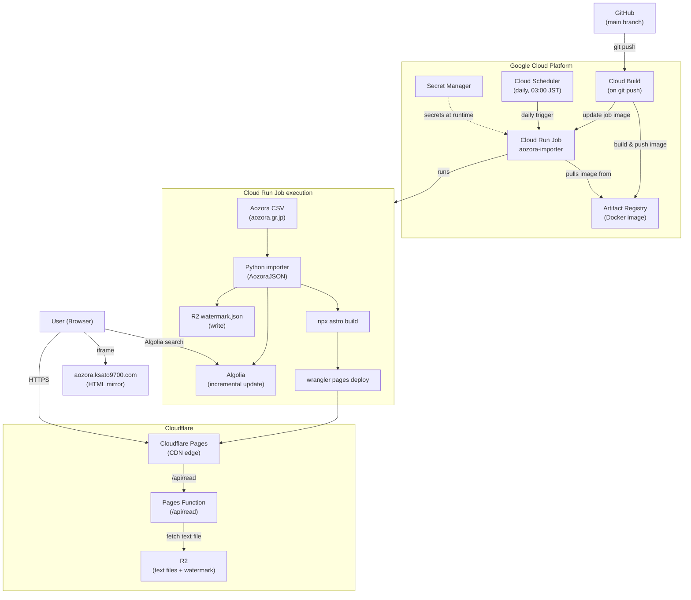

# Aozora Pages — Architecture

## Overview

Aozora Pages is a **statically generated site** built with Astro 6.0 and served from Cloudflare Pages. There is no runtime server. All HTML pages are pre-rendered once per day by a Cloud Run Job and deployed directly to Cloudflare's CDN.

### Core Technologies

| Concern | Technology |
|---|---|
| Site generation | Astro 6.0 (`output: 'static'`) |
| Hosting | Cloudflare Pages (edge CDN) |
| Search | Algolia (client-side React Island) |
| Text reader | Cloudflare Pages Function (`/api/read`) |
| Import pipeline | Python 3.13 + `uv`, runs as Cloud Run Job |
| Scheduling | Cloud Scheduler → Cloud Run Job (daily) |
| CI/CD | Cloud Build (build image + update job on git push) |
| Watermark state | Cloudflare R2 (`watermark.json`) |

---

## System Architecture


```mermaid
graph TD
    GitHub["GitHub\n(main branch)"]

    subgraph GCP["Google Cloud Platform"]
        CloudBuild["Cloud Build\n(on git push)"]
        ArtifactRegistry["Artifact Registry\n(Docker image)"]
        SecretManager["Secret Manager"]
        CloudScheduler["Cloud Scheduler\n(daily, 03:00 JST)"]
        CloudRunJob["Cloud Run Job\naozora-importer"]
    end

    subgraph Pipeline["Cloud Run Job execution"]
        CSV["Aozora CSV\n(aozora.gr.jp)"]
        Python["Python importer\n(AozoraJSON)"]
        Algolia["Algolia\n(incremental update)"]
        R2w["R2 watermark.json\n(write)"]
        AstroBuild["npx astro build"]
        Wrangler["wrangler pages deploy"]
    end

    subgraph Cloudflare["Cloudflare"]
        Pages["Cloudflare Pages\n(CDN edge)"]
        PagesFunc["Pages Function\n(/api/read)"]
        R2["R2\n(text files + watermark)"]
    end

    User["User (Browser)"]

    GitHub -->|git push| CloudBuild
    CloudBuild -->|build & push image| ArtifactRegistry
    CloudBuild -->|update job image| CloudRunJob

    CloudScheduler -->|daily trigger| CloudRunJob
    CloudRunJob -->|pulls image from| ArtifactRegistry
    CloudRunJob -->|runs| Pipeline
    SecretManager -.->|secrets at runtime| CloudRunJob

    CSV --> Python
    Python --> Algolia
    Python --> R2w
    Python --> AstroBuild
    AstroBuild --> Wrangler
    Wrangler --> Pages

    User -->|HTTPS| Pages
    Pages -->|/api/read| PagesFunc
    PagesFunc -->|fetch text file| R2
    User -->|Algolia search| Algolia
    User -->|iframe| AozoraHTML["aozora.ksato9700.com\n(HTML mirror)"]
```

---

## Component Architecture

### Astro Pages (build-time)

All pages call `getData()` at build time. `getData()` loads the three JSON files via Vite static imports and builds in-memory Maps.

| Page | Route | Description |
|---|---|---|
| `index.astro` | `/` | Home — 24 most recent books |
| `books/[bookId].astro` | `/books/:id` | Book detail |
| `books/new/[...page].astro` | `/books/new/:page` | Paginated new books |
| `persons/[personId].astro` | `/persons/:id` | Author profile |
| `read/index.astro` | `/read/` | Reader SPA shell (client-only) |
| `api/books-for-reader.json.ts` | `/api/books-for-reader.json` | Minimal book data for reader |

### React Islands (client-side)

Islands hydrate independently in the browser. The rest of the page is plain HTML with no JS.

| Component | Trigger | Description |
|---|---|---|
| `SearchSection.tsx` | `client:load` | Debounced Algolia search dropdown |
| `ReaderPage.tsx` | `client:only="react"` | Reads bookId from URL, fetches book data, renders reader |
| `ReaderIsland.tsx` | rendered by ReaderPage | HTML/text mode toggle, iframe + text renderer |

### Cloudflare Pages Function

`functions/api/read.ts` handles text file proxying:
- Receives `?src=<encoded-url>` from the browser
- Fetches the `.txt` or `.zip` from the given URL
- Decodes Shift_JIS using `TextDecoder('shift_jis')`
- Returns UTF-8 text to the browser

---

## Reader SPA Routing

The `/read/[bookId]` URL pattern used to generate ~17,700 static HTML files (one per book), which exceeded Cloudflare Pages' 20,000 file limit. It is now implemented as a single-page app:

```
astro/public/_redirects:
  /read/* /read/ 200        ← Cloudflare Pages rewrites all /read/* to /read/index.html

ReaderPage.tsx (client:only):
  1. Read bookId from window.location.pathname (/read/012345 → "012345")
  2. Fetch /api/books-for-reader.json (minimal book data, ~2–3 MB, cached)
  3. Render ReaderIsland with title, text_url, html_url
```

---

## Data Flow

### Build time

```
books.json  ──┐
persons.json ──┤── data.ts (Vite import) ──► getStaticPaths() ──► HTML files
contributors.json ──┘
```

### Runtime (search)

```
Browser keystroke
  └──► SearchSection.tsx (debounce)
         └──► Algolia API (client-side, search-only key)
                └──► ranked hits → dropdown
```

### Runtime (reader)

```
User visits /read/012345
  └──► Cloudflare Pages serves /read/index.html (via _redirects rewrite)
         └──► ReaderPage.tsx hydrates
                └──► fetch /api/books-for-reader.json
                └──► render ReaderIsland
                       └──► HTML mode: <iframe src="aozora.ksato9700.com/...">
                       └──► Text mode: fetch /api/read?src=<R2-url>
                                         └──► Pages Function → R2 → UTF-8 text
```

---

## Import Pipeline Detail

```
aozora_data/importer/main.py
  │
  ├── AozoraJSON()               ← in-memory accumulator
  ├── import_from_csv_url()      ← download + parse CSV
  │     ├── _process_row()       ← upsert_book / upsert_person / upsert_contributor
  │     └── _sync_algolia()      ← send changed records to Algolia
  ├── db.flush(DATA_DIR)         ← write books.json / persons.json / contributors.json
  └── db.save_watermark()        ← write watermark.json to R2
```

The `AozoraDB` Protocol (`db/__init__.py`) defines the interface shared by `AozoraJSON` and the legacy `AozoraFirestore`.

---

## Environment Variables

| Variable | Used by | Source |
|---|---|---|
| `R2_ACCOUNT_ID` | Python (boto3) | Secret Manager |
| `R2_ACCESS_KEY_ID` | Python (boto3) | Secret Manager |
| `R2_SECRET_ACCESS_KEY` | Python (boto3) | Secret Manager |
| `R2_BUCKET_NAME` | Python (boto3) | Cloud Run Job env var |
| `ALGOLIA_APP_ID` | Python + Astro build | Secret Manager |
| `ALGOLIA_ADMIN_KEY` | Python | Secret Manager |
| `PUBLIC_ALGOLIA_APP_ID` | Astro build (client) | Secret Manager |
| `PUBLIC_ALGOLIA_SEARCH_KEY` | Astro build (client) | Secret Manager |
| `CLOUDFLARE_API_TOKEN` | wrangler | Secret Manager |
| `CLOUDFLARE_ACCOUNT_ID` | wrangler | Cloud Run Job env var |
