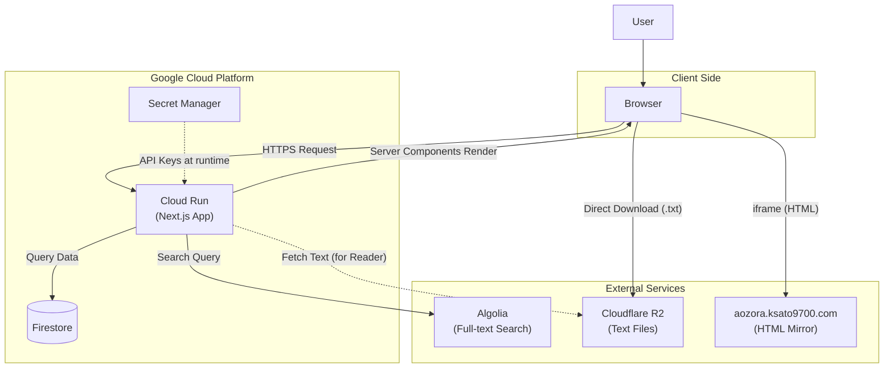
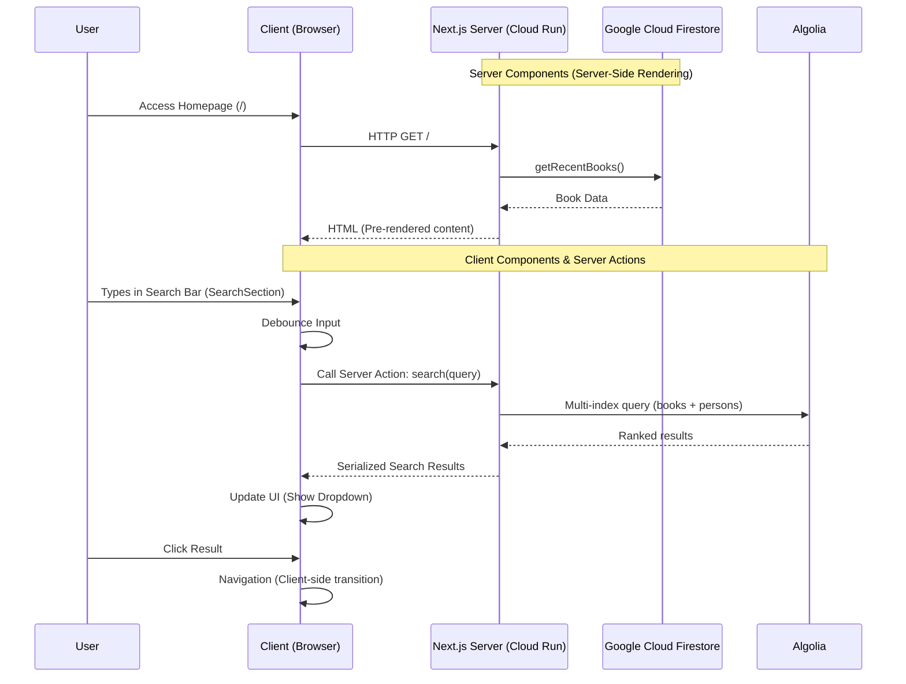

# Aozora Pages Architecture

This document outlines the architecture of the Aozora Pages application, built with Next.js App Router and hosted on Google Cloud Run.

## Overview

The application utilizes a hybrid rendering approach leveraging Next.js App Router's Server Components and Client Components, interacting with Google Cloud Firestore for data persistence and Algolia for full-text search.

### Core Technologies
- **Framework**: Next.js (App Router)
- **Deployment**: Google Cloud Run (Containerized)
- **Database**: Google Cloud Firestore
- **Search**: Algolia (multi-index full-text search)
- **Styling**: CSS Modules / Tailwind CSS

## Component Architecture

The application rigorously separates concerns between server and client to optimize performance and SEO.

### Server Components (`.tsx`)
By default, components in `app/` are Server Components. They render on the server, fetching data directly from Firestore before sending HTML to the client. This reduces client-side JavaScript bundle size.

**Key Server Components:**
- **`app/page.tsx`**: The main entry point. Fetches `recentBooks` directly from Firestore server-side and renders the initial list.
- **`components/BookCard.tsx`**: Purely presentational component that renders book details. Since it requires no interactivity, it remains a server component.
- **`app/layout.tsx`**: Defines the global application shell.

### Client Components (`'use client'`)
Client Components are opted-in via the `'use client'` directive. These handle user interactivity and browser APIs.

**Key Client Components:**
- **`components/SearchSection.tsx`**: Handles the live search UI.
  - Manages input state (`useState`).
  - Debounces user input.
  - Invokes the `search()` Server Action to fetch results.
  - Renders interactive search results dropdown.
- **`components/SearchInput.tsx`**: A reusable input component for handling navigation-based search queries.

### Server Actions (`actions.ts`)
Server Actions provide a secure way to execute server-side logic from Client Components without creating a separate API route.

- **`search(query)`**:
  - Located in `app/actions.ts`.
  - Called directly by `SearchSection.tsx`.
  - Issues a single Algolia multi-index query across `books` and `persons`.
  - Returns matched books and persons to the client.

## System Architecture Diagram


```mermaid
graph TD
    User[User]

    subgraph Client[Client Side]
        Browser[Browser]
    end

    subgraph GCP[Google Cloud Platform]
        CloudRun["Cloud Run<br/>(Next.js App)"]
        Firestore[(Firestore)]
        SecretManager["Secret Manager"]
    end

    subgraph External[External Services]
        Algolia["Algolia<br/>(Full-text Search)"]
        R2["Cloudflare R2<br/>(Text Files)"]
        AozoraHTML["aozora.ksato9700.com<br/>(HTML Mirror)"]
    end

    User --> Browser

    %% Web Application Flow
    Browser -- "HTTPS Request" --> CloudRun
    CloudRun -- "Server Components Render" --> Browser

    %% Data Access
    CloudRun -- "Query Data" --> Firestore
    CloudRun -- "Search Query" --> Algolia

    %% Secrets
    SecretManager -. "API Keys at runtime" .-> CloudRun

    %% Content Delivery
    CloudRun -. "Fetch Text (for Reader)" .-> R2
    Browser -- "Direct Download (.txt)" --> R2
    Browser -- "iframe (HTML)" --> AozoraHTML
```

## Data Flow & Interaction Diagram


```mermaid
sequenceDiagram
    participant User
    participant Browser as Client (Browser)
    participant Server as Next.js Server (Cloud Run)
    participant Firestore as Google Cloud Firestore
    participant Algolia as Algolia

    Note over Server, Firestore: Server Components (Server-Side Rendering)

    User->>Browser: Access Homepage (/)
    Browser->>Server: HTTP GET /
    Server->>Firestore: getRecentBooks()
    Firestore-->>Server: Book Data
    Server-->>Browser: HTML (Pre-rendered content)

    Note over Browser, Algolia: Client Components & Server Actions

    User->>Browser: Types in Search Bar (SearchSection)
    Browser->>Browser: Debounce Input
    Browser->>Server: Call Server Action: search(query)
    Server->>Algolia: Multi-index query (books + persons)
    Algolia-->>Server: Ranked results
    Server-->>Browser: Serialized Search Results
    Browser->>Browser: Update UI (Show Dropdown)
    User->>Browser: Click Result
    Browser->>Browser: Navigation (Client-side transition)
```

## Directory Structure Map

```
web/src/
├── app/
│   ├── page.tsx          # [Server] Main landing page, fetches data
│   ├── layout.tsx        # [Server] Root layout
│   └── actions.ts        # [Server Action] search() — delegates to Algolia
├── components/
│   ├── BookCard.tsx      # [Server] Stateless UI for book display
│   ├── SearchSection.tsx # [Client] Stateful search with dropdown
│   └── SearchInput.tsx   # [Client] Input managing URL params
└── lib/
    ├── algolia/          # [Server] Algolia client and unified search
    │   ├── client.ts
    │   └── search.ts
    └── firestore/        # [Server] Data access layer (Firestore SDK)
        ├── books.ts
        ├── persons.ts
        └── contributors.ts
```
